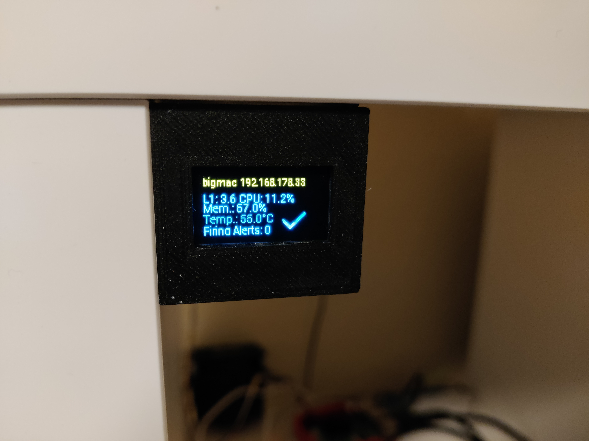

# Raspberry Pi Mini OLED Status Display
Use a SSD1306 128x64 OLED Display connected over I2C to show system info about your Raspberry Pi.

## Setup
 - enable I2C in raspi-config
 - plug in your display to the I2C pins
 - clone this repo
 - run `pip3 install -r requirements.txt`
 - adjust the settings at the top of main.py
 - copy the service file to /etc/systemd/system
 - run `sudo systemctl enable --now` to enable and start the service.